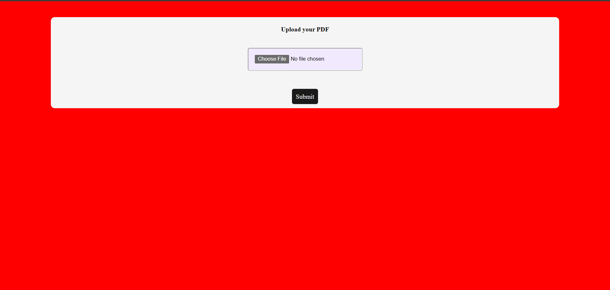
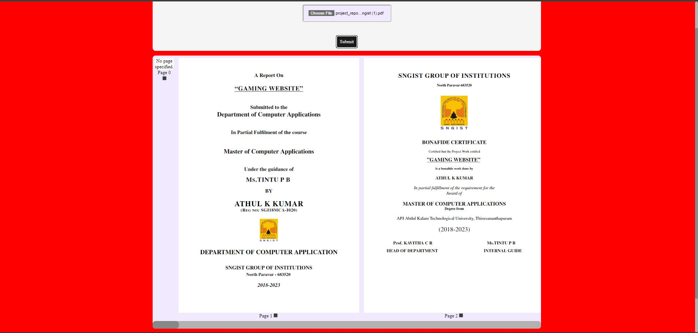
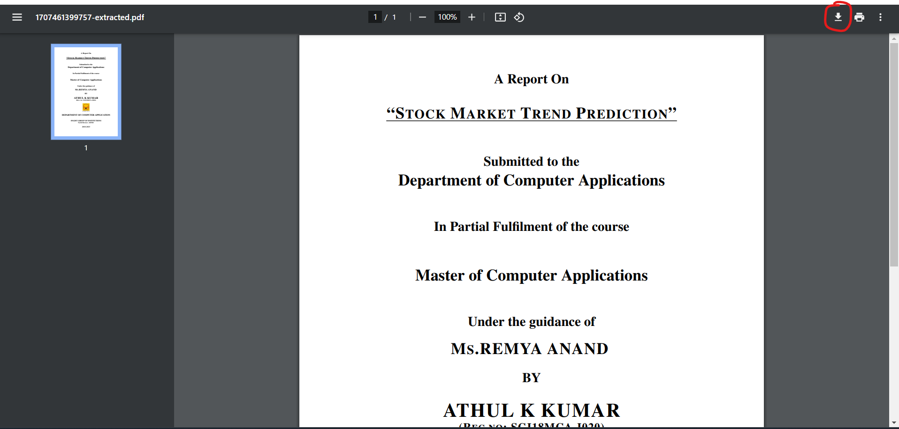

# PDF-Editor

PDF-Editor is an application designed to extract pages from a PDF file and create a new PDF document from them.

## Installation

### Client

1. Navigate to the `./client` directory.
2. Create an `.env` file and add the following environment variable:
   ```
   VITE_API_URL=http://localhost:5000
   ```
3. Run `npm install` to install dependencies.
4. To start the client, run `npm run dev`.

### Server

1. Navigate to the `./server/` directory.
2. Create an `.env` file and add the following variables:
   ```
   PORT=5000
   CLIENT_URL=http://localhost:3000
   ```
3. Run `npm install` to install dependencies.
4. To start the server, run `npm run dev`.

## Screenshots

### Home Page



- This is the home page where you can add a PDF file.

### PDF File Added



- After adding the PDF file, click the submit button to view the added PDF file.

### Select Pages


- You will see checkboxes under each page to select which pages you want to extract.

### View Extracted PDF


- After clicking on "Extract", you will get a "View & Download" button to see the extracted PDF.

### Download Extracted PDF



- On the top-right corner of the extracted PDF, you will find an option to download the extracted PDF if needed.
